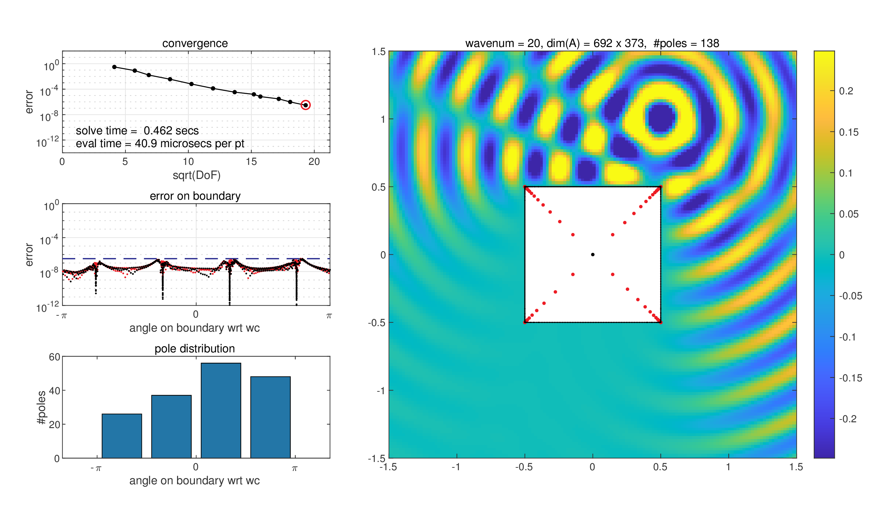
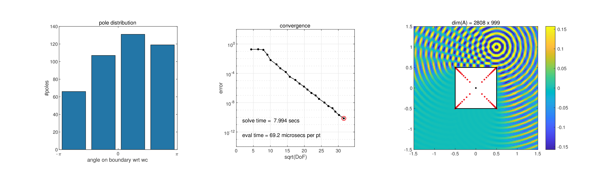
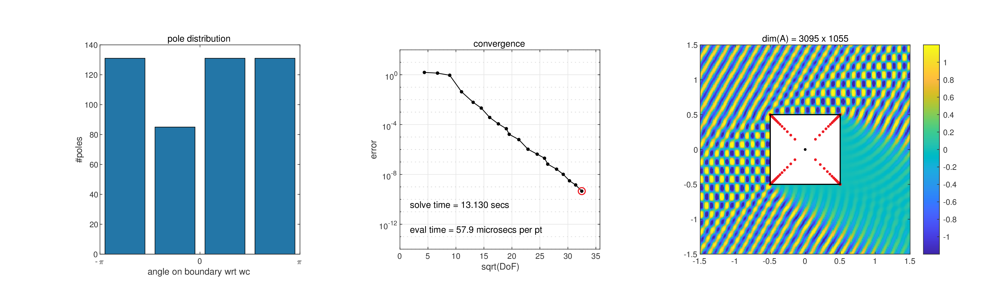

# Lightning Helmholtz Solver


<p align="center">
    
    
</p>


<!-- [https://user-images.githubusercontent.com/77754538/194108726-112bab3b-30c4-443d-9f5c-154a378ba39d.mp4]:: -->


The Helmholtz equation is an elliptic partial differential equation (PDE) and represents a time-independent form of the wave equation.
It is named after German physicist Hermann von Helmholtz (1821-1894) and has many applications in physics, including acoustics, seismology, and electromagnetic radiation.
The lightning method for solving PDEs with exceptional speed and accuracy has accomplished remarkable success with its original introduction for solving the Laplace equation, which has a state-of-the-art implementation that solves typical problems in less than 1 second on a desktop to 8-digit accuracy [[1]](#1).
This repository contains `helmholtz.m`, an implementation of the lightning method for solving the Helmholtz equation, carried out during my thesis entitled *Lightning Helmholtz solver*.
I completed this under the supervision of Professor Nick Trefethen as part of the MSc in Mathematical Sciences at the University of Oxford.

`helmholtz.m` solves the Helmholtz equation on a domain exterior to a polygon $P$ for small or medium wavenumbers $k > 0$ with inhomogenous boundary data, provided by $g$.
That is, the solver approximates $u$ as to satisfy the following

$$\Delta u(z) + k^2u(z) = 0, \quad z \in \Omega$$

$$u(z) = g(z), \quad z \in P$$

### Scattering
<!-- 
The solver is best demonstrated by a scattering problem.
In a direct scattering bounded obstacle, time-harmonic  -->


The solver is best demonstrated by the direct scattering problem of a time-harmonic wave from a bounded, sound-soft obstacle.
This concerns the effect of an impenetrable obstacle on an incident wave and considers the total field as a sum of incident and scattered fields, $u^{\text{t}} = u^{\text{i}} + u^{\text{s}}$.


<!-- For this problem, the total field is considered as a sum of the the incident and scatter fields, that is $u^{\text{t}} = u^{\text{i}} + u^{\text{s}}$.  -->
More specifically, for a given incident field $u^{\text{i}}$ that satisfies the Helmholtz equation, we wish to determinine a scattered field $u^{\text{s}}$ such that the total field $u^{\text{t}} = u^{\text{i}} + u^{\text{s}}$ satisfies the Helmholtz equation in the region outside of the obstacle, and vanishes at the boundary.

<!-- For a sound-soft object, Homogeneous boundary conditions  -->


This problem of solving for the scattered field $u^{\text{s}}$ can be written as an inhomogeneous boundary value problem, suitable for our solver:

<!-- 
This boils down to the following inhomogeneous boundary value problem -->

$$\Delta u^{\text{s}}(z) + k^2u^{\text{s}}(z) = 0, \quad z \in \Omega$$

$$u^{\text{s}}(z) = -u^{\text{i}}(z), \quad z \in P$$


<!-- 
(impenetrable)

direct, bounded obstacle, time-harmonic
A direct sound-soft scattering problem concerns determining a scattered field from the effect of an incident field on a scattering obstacle.

As mentioned, the Helmholtz equation represents the time-harmonic wave equation and so we can consider the effect of a bounded obstacle on an incident time-harmonic wave.
The total field is  -->


<!-- 
Scattering theory is concerned with the effect obstacles or inhomogeneities have on an incident waves.

The Direct Problem: This problem is concerned with determining the scattered field from the knowledge of the incident field and the scattering obstacle.

The propagation of waves in a homogeneous, isotropic medium is mathematically described by the wave equation,


Direct Scattering Problems

Scattering by a bounded obstacle

Scattering by a sound soft obstacle
The scattering problem can then be formulated as a boundary value problem for the scattered field in the region outside the scattering obstacle, consisting of

the Helmholtz equation,
a boundary condition on the boundary of the scattering obstacle,
Sommerfeld's radiation condition. -->


<!-- , a brief description for which now follows.

A function that solves the Helmholtz equation is used to sample the boundary 
The solver can handle any valid user-specified boundary sampling function and in fact the boundary data can be specified pointwise for each side of the polygon.
However, 


The function $u$ is approximated as to match the incident field $g$ and consequently make the total field vanish at the boundary.
Then the total field is represented by $f = g-u$ which has a vanishing field at the boundary by the construction of $u$ matching $g$.
By linearity of the Helmholtz equation and the fact that $g$ satisfies the Helmholtz equation, $f$ satisfies the Helmholtz equation with homogeneous boundary condition, that is
$$\Delta f(z) + k^2f(z) = 0, \quad z \in \Omega$$

$$f(z) = 0, \quad z \in P$$
 -->

Concerning the boundary sampling function, $g$, common incident fields, which are built into the solver, are the following:

- propogating plane wave from an incident angle of propogation, $\theta$
$$g_\theta(z) = -\exp{\left(-i\text{Re}\left\[kze^{-i\theta}\right\]\right)} \quad \theta \in \[0, 2\pi)$$

- point source radiating from a point source $z_\*$
$$g_{z_\*}(z) = -H_0^{(1)}\left(k \lvert z - z_{\*} \rvert\right) \quad z_{\*} \in \Omega$$

## Usage

`U = helmholtz(wavenum, P, g)` solves the Helmholtz equation with
Dirichlet boundary data on the simply-connected region $\Omega$ bounded by `P`, which may be a polygon or circular polygon.


      
### Input arguments

#### Required positional arguments


1. `wavenum` (integer value greater than 0)  
    The sign of `wavnum` is used as an indicator to determine the default value for `g`.
    Negative integers are used to indicate plane wave propogation or point source radiation problem.
    The wavenumber for the problem is taken to be the absolute value of `wavnum`, a minus sign can meerly be used as a flag.
    
2. `P` (vector, string, or integer value)  
   One of the following:
    - Vector of corners as complex numbers $z = x+iy$ in counterclockwise order to specify a polygon or cell array of corners `v` and pairs `[v r]` to specify a circular polygon: $r =$ radius of curvature of arc from corner `v` to the next.
    - String from one of the predefined polygons in the table below.
    -  Integer $\ge 3$, the number of corners of a random polygon.
    -  Integer $\le -3, -1$ $\times$ number of corners of a random circular polygon.
    
    | String     | Description |
    | :--------- | :---------: |
    | `'sqr'`    | square      |
    | `'rec'`    | rectangle   |
    | `'snow'`   | snowflake   |
    | `'pent'`   | pentagaon   |
    | `'hex'`    | hexagon     |
    | `'L'`      | L-shape     |
    | `'circleL'`| circle L shape |
    | `'C'`      | C shape |
    | `bullet`   | bullet |


#### Optional positional arguments
3. `g` (function handle)  
     Function handle for Dirichlet boundary data that satisfies the Helmholtz equation or cell array of function handles for sides `P1`-`P2`, `P2`-`P3`, ...  
      Default:
      - `@(z) exp(-1i*real(wavenum*exp(-1i*z0ang)*z)))` for `wavenum`$>0$
      - `@(z) @(z) besselh(0,-wavenum*abs(z-(z0_pt)))` for `wavenum`$<0$.  
      These functions represent incident plane waves and point source radiatiating waves respectively.


#### Optional name-value arguments

Optional pairs of arguments as `Name1, Value1, ..., NameN, ValueN`, where Name is the argument name and Value is the corresponding value.
Name-value arguments must appear after other arguments, but the order of the pairs does not matter.


- `tol` (positive real scalar)  
    Tolerance for maximal absolute error. Default 1e-6.
- `z0` (scalar)  
    The point source location for point source radiating waves (`wavenum` $>0$), or the angle of incidence for plane waves (`wavenum` $<0$).
    For plane waves, either an angle can be passed as a real scalar or a point can be passed as a complex scalar, in which case the angle will be taken as `angle(z0)`. Default: $0.5+1i$.
     
- `fs` (scalar value greater than 0)  
      Default 12. set font size for plots


<!-- | Parameter   | Type | Default | Description |
| :---------- | :--: | :------:| :-----------|
| `tol`       | float | 1e-6 | tolerance |
| `z0`        | complex number |
| `noplots`   | flag |
| `noplots3d` | flag |
| `steps`     | flag |
| `scat`      | flag |
| `slow`      | flag |
| `fs`        | float+ | 12? | set font size for plots | -->


The following flag parameters can be specified:


| Flag        | Description |
| :---------- | :-----------|
| `noplots`   | surpresses all plotting |
| `noplots3d` | surpresses 3D surface plotting |
| `steps`     | produces step-by-step plots of errors on boundary and poles |
| `noscat`    | turns off scattering mode, in which case the solution $u$ is plotted  |
| `slow`      | turns off adaptive mode for cleaner root-exponential convergence curves |


<!--`'sqr'`[square], `'rec'`[tangle], `'snow'`[flake], `'pent'`[agaon], `'hex'`[agon], `'L'`, `'circleL'`, or `'C'`-->

<!-- If you don't specify a particular option, its default value is used. The
available configuration options are:

- `g`

    (string) The attributes that every function declared with this
    keyword should have (in the form of source code, with a leading `:`).

    Default: nothing

- `tol`

    (string) The attributes that every function declared with this
    keyword should have (in the form of source code, with a leading `:`).

    Default: nothing
- `tol`
- `z0`
- `noplots`
- `noplots3d`
- `steps`
- `scat`
- `slow`
- `fs` -->


### Output arguments

[u, maxerr, tsolve, nkv, Z, Zplot, pol, A]

- `u`
- `maxerr`
- `tsolve`
- `nkv`
- `Z`
- `Zplot`
- `pol`
- `A`

    
## Examples

Plane with square
```MATLAB
helmholtz(50,'sqr');
```

Point with square
```MATLAB
helmholtz(-50,'sqr');
```

Pentagon
```MATLAB
helmholtz(-20,'pent','tol',1e-10);
```

Circular L-shape
```MATLAB
helmholtz(-20,'circleL','z0',2+3i);
```

Bullet
```MATLAB
helmholtz(20,'bullet','z0',1);
```

Snowflake
```MATLAB
helmholtz(-30,'snow','steps')
```

Triangle
```MATLAB
helmholtz(50,[1/2*exp(2i*pi*([1:3])/3)],'z0',1i)
```

Two point sources:
```MATLAB
wavenum = -30; z0_pt = .5+1i;
g = @(z) besselh(0,-wavenum*abs(z-(z0_pt))) + besselh(0,-wavenum*abs(z-(-z0_pt')));
helmholtz(wavenum,'sqr',g,'noplot3d');
```


#### (readme is in progress)


<p align="center">
    
</p>

Example output of the solver for a point source incident wave with wavenumber $k=20$ and default parameters. The Helmholtz equation is solved on the domain exterior to a square to 6 digits of accuracy in under half a second on a laptop.

<p align="center">
    
    
</p>

Decreasing the tolerance imporoves the accuracy of the solution.
For wavenumber $k=50$, the solver can achieve 10 digits of accuracy in under 8 seconds for a point source wave and 9 digits of accuracy in under 14 seconds for a plane wave.


<p align="center">
    
</p>


## References
<a id="1">[1]</a> 
Abinand Gopal and Lloyd N. Trefethen. New laplace and helmholtz solvers. Proceedings of the National Academy of Sciences of the United States of America, 116:10223 – 10225, 2019.
<!-- 
Dijkstra, E. W. (1968). 
Go to statement considered harmful. 
Communications of the ACM, 11(3), 147-148. -->


